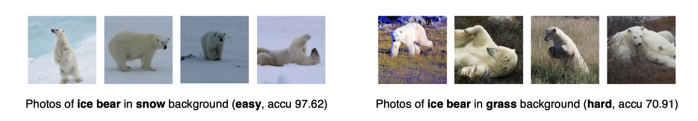
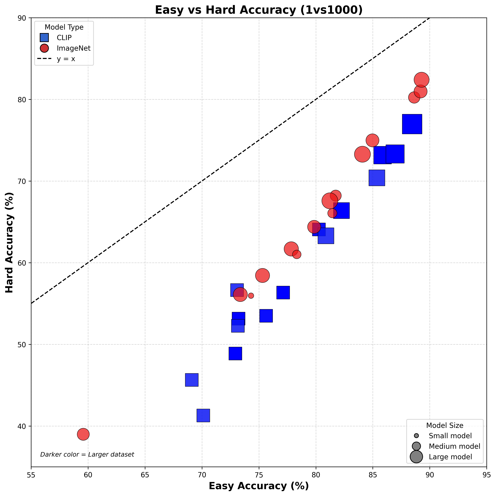
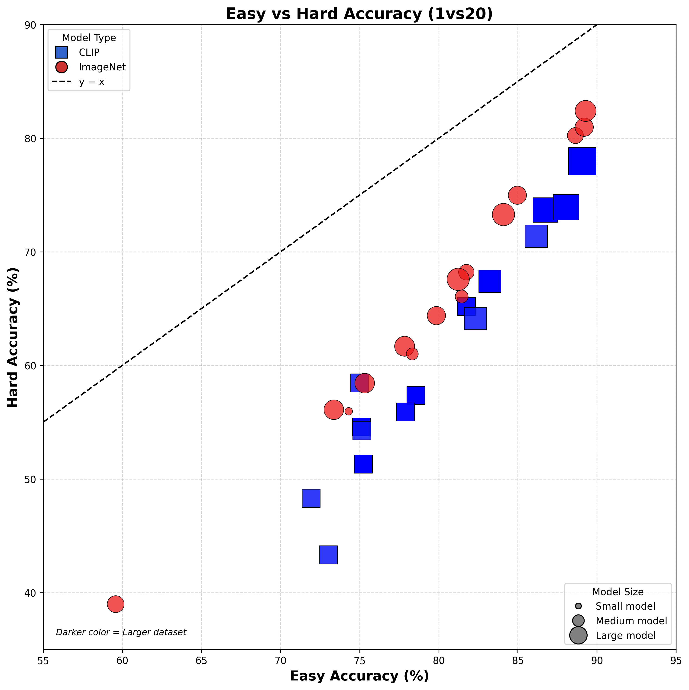
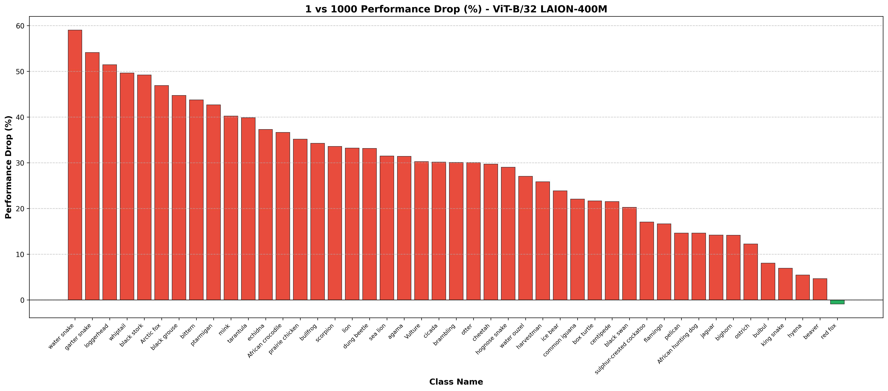
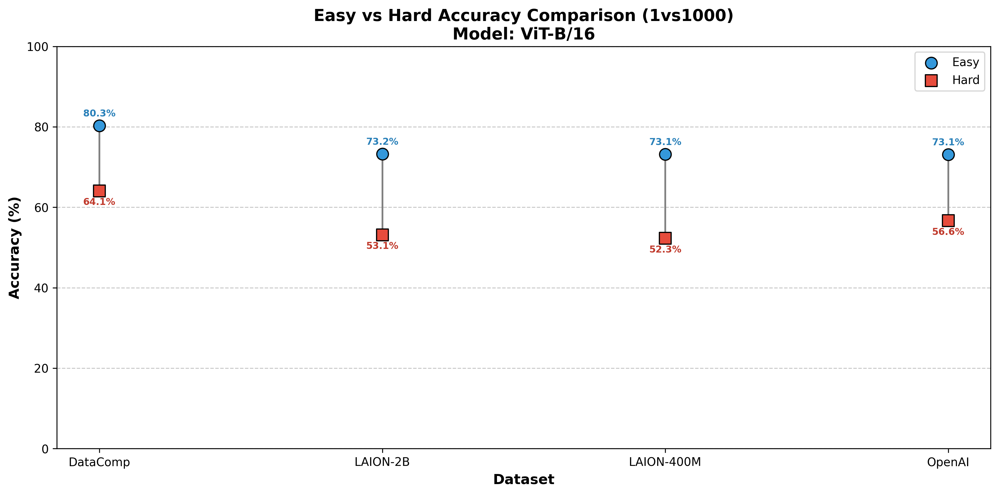
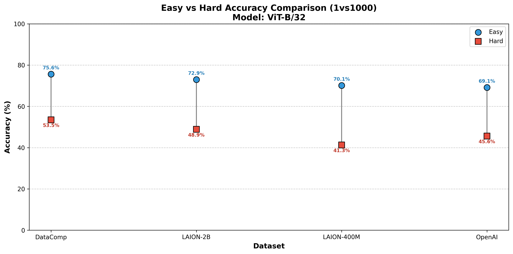
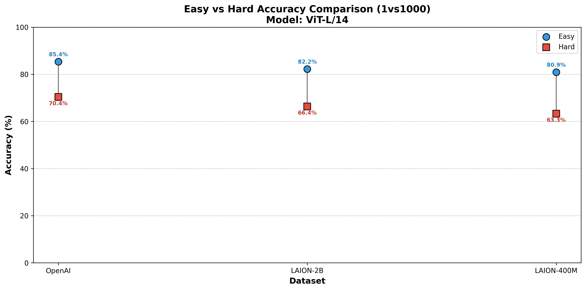
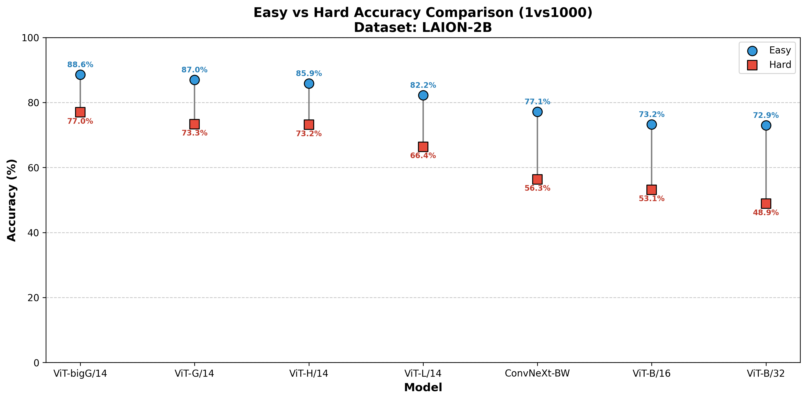

# A Sober Look at the Robustness of CLIPs to Spurious Features

This readme file is an outcome of the [CENG7880 (Fall 2025)](https://metu-trai.github.io/) project for reproducing a paper which does not have an implementation.

# 1. Introduction

This project focuses on reproducing and validating the findings presented in the paper "**A Sober Look at the Robustness of CLIPs to Spurious Features**" by Wang et al., published at NeurIPS 2024. The paper is also available on arXiv (arXiv:2403.11497v2). 

Large vision-language models (LVLMs), particularly those based on Contrastive Language-Image Pre-training (CLIP), have demonstrated remarkable success across a wide range of vision and multi-modal tasks, significantly outperforming conventional ImageNet-trained models. CLIP models are trained on massive web-scale datasets such as LAION, which are substantially larger and more diverse than ImageNet. This paradigm shift from ImageNet pre-training to web-scale multi-modal datasets has revolutionized modern vision and vision-language modeling.

A key characteristic often attributed to CLIP models is their impressive robustness against various distribution shifts, especially when compared to ImageNet models. However, a critical issue highlighted by this paper is that existing testsets used to evaluate CLIP's robustness (primarily ImageNet variants) were designed for ImageNet-based models and may not adequately reflect CLIP's true robustness when faced with spurious features inherent in its own training data (e.g., LAION).

**The Goal of this Reproduction Project:**

Our primary objective is to reproduce the key findings and experiments presented in this paper, specifically:

1. **Empirical Validation**: Replicate the experimental results across various CLIP configurations (different backbones, pre-training datasets, and scales) using the `CounterAnimal` dataset introduced in this paper to verify that the spurious features are indeed generally learned by CLIP models.

2. **Comparative Analysis**: Reproduce the comparative evaluations between CLIP models and ImageNet models to confirm the finding that ImageNet models exhibit greater robustness to the spurious correlations captured in `CounterAnimal`.

3. **Scaling Analysis**: Investigate the effects of scaling up model parameters and using high-quality pre-training data on robustness to spurious features.

Through this reproduction, we aim to verify the paper's central claim that CLIP models, despite their impressive performance on ImageNet variants, are still susceptible to spurious correlations present in web-scale training data, and that appropriate benchmarking is crucial for properly assessing model robustness.

## 1.1. Paper summary

### Overview and Motivation

The paper addresses a fundamental issue in evaluating the robustness of large vision-language models (LVLMs), particularly CLIP models. While CLIP has shown impressive robustness on ImageNet-oriented distribution shift benchmarks, the authors argue that these benchmarks may not accurately reflect CLIP's true robustness to spurious features present in its own training data. Spurious features are attributes highly correlated with labels during training but whose correlation breaks down under distribution shifts. The key research question posed is: **"Is there a benchmark that reflects the exact reliance on spurious features of CLIP?"**

### The CounterAnimal Dataset

To address this gap, the authors introduce **`CounterAnimal`**, a novel benchmark dataset specifically designed to assess CLIP models' robustness against real-world spurious features. The dataset focuses on animal classification where spurious correlations exist between animals and their background environments.

**Construction Pipeline:**
The dataset construction involves four main steps:

1. **Data Collection**: Raw photos are collected from iNaturalist (a global biodiversity data-sharing platform) by querying animal names from the ImageNet-1K dataset, retrieving 300-800 photos per animal class.

2. **Data Curation**: Manual cleansing of low-quality photos that contain label noise, feature noise, obscurity, or clarity issues (e.g., occluded animals, multiple objects).

3. **Background Labeling**: Manual annotation of photos with their respective backgrounds from a candidate space including: ground, water, earth, sand, snow, grass, human, sky, road, rock, shrub, indoor, tree, and outdoor.

4. **Spurious Discovery**: Classes are selected based on zero-shot performance drops (>5%) when backgrounds shift. Photos are split into two groups:
   - **Easy group**: Animals in commonly appeared backgrounds where CLIP models make correct predictions
   - **Hard group**: Animals in less common but still plausible backgrounds where CLIP models are likely to fail

The resulting `CounterAnimal` dataset comprises 45 animal classes with 7,174 easy photos and 5,926 hard photos. For example, the class "ice bear" shows 97.62% accuracy on the easy group (snow background) but drops to 70.91% on the hard group (grass background) for CLIP-LAION400M-ViT-B/32.

**Sample polar bear photos from CounterAnimal-easy and CounterAnimal-hard**


### Empirical Findings

The paper presents extensive experimental evaluations across multiple dimensions:

**1. Generality of Spurious Correlations:**
- The spurious features captured by `CounterAnimal` are consistently learned across different CLIP configurations (various backbones like ViT-B/32, ViT-B/16, ViT-L/14, and different pre-training datasets like LAION400M, LAION2B, OpenAI)
- Performance drops range from 10% to 30% across different CLIP models, demonstrating that these spurious correlations are pervasive in web-scale multi-modal datasets

**2. Comparison with ImageNet Models:**
- Surprisingly, ImageNet-trained models (including AlexNet, VGG, ResNet, ViT, and ConvNeXt variants) show **greater robustness** to the spurious features in `CounterAnimal` compared to CLIP models
- This finding contrasts sharply with previous studies on ImageNet variants where CLIP consistently outperforms ImageNet models
- It highlights that different training paradigms and data sources lead to different types of spurious correlations

**3. Effect of Model Scaling:**
- **Larger CLIP backbones** (measured by parameter count) demonstrate improved robustness, with performance drops decreasing as model size increases (e.g., ViT-G/14 shows smaller drops than ViT-B/32)
- However, **increasing pre-training data scale alone** (e.g., from LAION400M to LAION2B) does not necessarily reduce spurious feature reliance, suggesting that simply collecting more data cannot rectify biases

**4. Importance of Data Quality:**
- CLIP models trained on **high-quality curated datasets** (DataComp and Data Filtering Networks) exhibit significantly enhanced robustness compared to those trained on unfiltered datasets
- For example, CLIP-DFN2B-ViT-L/14 shows only 10.22% drop compared to 15.96% for CLIP-LAION2B-ViT-L/14
- This suggests that data quality improvement remains a promising strategy for mitigating spurious features


### Theoretical Analysis

The paper provides theoretical justification for why CLIP models learn spurious features:

**Key Theoretical Result:**
- Under a linear multi-modal contrastive learning setup with one invariant feature and one spurious feature, the authors prove that CLIP will learn to align spurious features (e.g., backgrounds) with object captions when:
  - Strong spurious correlations exist in training data (p_spu close to 1)
  - Spurious features occupy a relatively large portion of the image (μ_spu ≥ (σ²_inv + 2)/2)
  - The model is overparameterized
  
- This leads to high error rates on out-of-distribution test data where spurious correlations break down

### Evaluation Setups

The paper employs two evaluation protocols:

1. **1 vs. 1000 setup**: Uses the full ImageNet-1K class names (1000 classes) as the candidate label space for classification
2. **1 vs. 20 setup**: Uses only the top-20 most confusing classes (determined by CLIP-LAION400M-ViT-B/32) for more focused evaluation, especially useful for computationally expensive LVLMs

### Contributions and Significance

**Main Contributions:**

1. **Novel Benchmark**: Introduction of `CounterAnimal`, the first benchmark specifically designed to evaluate CLIP models' robustness to spurious features inherent in web-scale multi-modal data, rather than ImageNet-oriented shifts

2. **Comprehensive Empirical Analysis**: Systematic evaluation across 20+ CLIP configurations, showing that spurious feature learning is a general problem across different backbones, pre-training datasets, and model scales

3. **Paradigm-Specific Insights**: Demonstration that spurious correlations are training-paradigm-specific—what affects CLIP may not affect ImageNet models and vice versa, emphasizing the need for appropriate benchmarks

4. **Theoretical Foundation**: First theoretical proof showing that CLIP's contrastive objective does not provide inherent robustness to spurious features, with empirical validation on synthetic datasets

5. **Practical Guidelines**: Identification of effective strategies for improving robustness:
   - Scaling up model parameters (backbones)
   - Improving pre-training data quality through careful curation
   - Note that simply increasing data quantity is insufficient

# 2. The method and my interpretation

## 2.1. The original method

The paper employs two evaluation setups:

| Setup | Label Space |
|:---|:---|
| **1 vs. 1000** | Full ImageNet-1K (1000 classes) | 
| **1 vs. 20** | Top-20 most confusing classes | 

For zero-shot classification, the text prompt `"A photo of {class_name}"` is used, and predictions are made by computing cosine similarity between image and text embeddings.

## 2.2. My interpretation

### 2.2.1. Confusing Classes for 1 vs. 20 Setup

The paper uses a **1 vs. 20 setup** for evaluating the models, where instead of comparing against all 1000 ImageNet classes, only the top-20 most confusing classes are used as the candidate label space.

To generate `confusing_classes.json`, we use the following methodology:

1. **Extract embeddings**: Using CLIP-LAION400M-ViT-B/32 (the proxy model used in the paper), extract image embeddings for all photos in the CounterAnimal dataset and text embeddings for all 1000 ImageNet class names.

2. **Compute similarities**: For each animal class in CounterAnimal, compute the average cosine similarity between all image embeddings (from both Easy and Hard groups) and each of the 1000 text embeddings.

3. **Select top-20**: For each animal class, select the 20 ImageNet classes with the highest average cosine similarity. These represent the classes that CLIP is most likely to confuse with the target animal.

The resulting JSON maps each animal's ImageNet class ID to a list of its top-20 confusing class IDs (including itself, which should be ranked first for correctly classified samples).

### 2.2.2. Model Checkpoint Interpretation

The paper references specific OpenCLIP checkpoints in their experiments. For **ViT-bigG/14 trained on LAION-2B**, the paper lists the checkpoint version as `S34B B160K`. However, this checkpoint identifier does not exist in the OpenCLIP model hub. 

We interpreted this as **`S39B B160K`** (laion2b_s39b_b160k), which is the actual available checkpoint for ViT-bigG/14 on LAION-2B in the OpenCLIP repository. This is likely a typo in the original paper, as S39B represents ~39 billion samples seen during training, which aligns with the LAION-2B training regime for the largest models.

### 2.2.3. OpenAI CLIP Models

The original paper evaluates OpenAI's closed-source CLIP models. Since the exact training data (WIT-400M) is not publicly available, we used the official OpenAI CLIP checkpoints from the `transformers` library:
- `openai/clip-vit-base-patch16` (ViT-B/16)
- `openai/clip-vit-base-patch32` (ViT-B/32)
- `openai/clip-vit-large-patch14` (ViT-L/14)

These checkpoints are the publicly released versions that match the paper's evaluation.

# 3. Experiments and results

## 3.1. Experimental setup

### Dataset

We use the **CounterAnimal** dataset, which contains 45 animal classes with 7,174 easy photos and 5,926 hard photos. The dataset is organized with the following structure:

```
LAION-final/
├── 10 salamander/
│   ├── common-grass/       # Easy split (common backgrounds)
│   └── counter-snow/       # Hard split (counter backgrounds)
├── 100 black swan/
│   ├── common-water/
│   └── counter-grass/
└── ...
```

An `imagenet_names.txt` file is required for text embedding extraction, containing ImageNet class names in the format:
```
0	tench, Tinca tinca
1	goldfish, Carassius auratus
...
```

### Models Evaluated

**CLIP Models (via OpenCLIP/Transformers):**
| Model Key | Description | Pre-training Data |
|:--|:--|:--|
| `vit_b16_laion400m` | CLIP-ViT-B/16 | LAION-400M |
| `vit_b16_laion2b` | CLIP-ViT-B/16 | LAION-2B |
| `vit_b16_datacomp` | CLIP-ViT-B/16 | DataComp |
| `vit_b32_laion400m` | CLIP-ViT-B/32 | LAION-400M |
| `vit_b32_laion2b` | CLIP-ViT-B/32 | LAION-2B |
| `vit_b32_datacomp` | CLIP-ViT-B/32 | DataComp |
| `vit_l14_laion400m` | CLIP-ViT-L/14 | LAION-400M |
| `vit_l14_laion2b` | CLIP-ViT-L/14 | LAION-2B |
| `vit_h14_laion2b` | CLIP-ViT-H/14 | LAION-2B |
| `vit_g14_laion2b` | CLIP-ViT-G/14 | LAION-2B |
| `vit_bigg14_laion2b` | CLIP-ViT-bigG/14 | LAION-2B |
| `convnext_bw_laion2b` | CLIP-ConvNeXt-BW | LAION-2B |
| `openai_vit_b16` | OpenAI CLIP-ViT-B/16 | OpenAI |
| `openai_vit_b32` | OpenAI CLIP-ViT-B/32 | OpenAI |
| `openai_vit_l14` | OpenAI CLIP-ViT-L/14 | OpenAI |

**ImageNet Supervised Models (via torchvision):**
- AlexNet, VGG-11, VGG-13, VGG-19
- ResNet-18, ResNet-34, ResNet-50, ResNet-101
- ViT-B/16, ViT-B/32, ViT-L/16, ViT-L/32
- ConvNeXt-S, ConvNeXt-B, ConvNeXt-L

### Evaluation Settings

- **1 vs. 1000 setup**: Uses the full ImageNet-1K class names (1000 classes) as the candidate label space
- **1 vs. 20 setup**: Uses only the top-20 most confusing classes per animal (determined by CLIP-LAION400M-ViT-B/32)
- **Text template**: `"A photo of {class_name}"` for text embeddings
- **Batch sizes**: 32 for image embedding extraction, 64 for text embedding and ImageNet model evaluation

## 3.2. Running the code

### Project Structure

```
├── extract_embeddings.py           # Extract CLIP image embeddings
├── extract_text_embeddings.py      # Extract CLIP text embeddings  
├── test_clip.ipynb                 # CLIP model evaluation notebook
├── evaluate_counteranimal_imagenet_models.ipynb  # ImageNet model evaluation
├── confusing_classes.json          # Top-20 confusing classes for 1vs20 setup
├── LAION-final/                    # CounterAnimal dataset
├── embeddings/                     # Extracted embeddings
│   ├── image_embeddings/{model}/   
│   └── text_embeddings/{model}/    
└── results/                        # Evaluation results (CSV files)
```

### Step 1: Extract Image Embeddings

Use `extract_embeddings.py` to extract CLIP image embeddings from the CounterAnimal dataset:

```bash
python extract_embeddings.py \
    --model vit_b16_laion2b \
    --dataset_root LAION-final \
    --output_root embeddings/image_embeddings \
    --batch_size 32 \
    --num_workers 4
```

**Available models**: `vit_b16_laion400m`, `vit_b16_laion2b`, `vit_b16_datacomp`, `vit_b32_laion400m`, `vit_b32_laion2b`, `vit_b32_datacomp`, `vit_l14_laion400m`, `vit_l14_laion2b`, `vit_h14_laion2b`, `vit_g14_laion2b`, `vit_bigg14_laion2b`, `convnext_bw_laion2b`, `openai_vit_b16`, `openai_vit_b32`, `openai_vit_l14`

This creates a mirrored directory structure with `.npy` files for each image.

### Step 2: Extract Text Embeddings

Use `extract_text_embeddings.py` to extract CLIP text embeddings for ImageNet class names:

```bash
python extract_text_embeddings.py \
    --model vit_b16_laion2b \
    --imagenet_file LAION-final/imagenet_names.txt \
    --output_root embeddings/text_embeddings \
    --prompt_template "A photo of {}" \
    --batch_size 64
```

This creates 1000 `.npy` files named `{class_id}_{class_name}.npy` for each ImageNet class.

### Step 3: Generate Confusing Classes (1 vs 20 Setup)

The `confusing_classes.json` file contains the top-20 most confusing classes for each animal class, determined by CLIP-LAION400M-ViT-B/32 predictions. The format is:
```json
{
    "10": [10, 15, 13, 11, 19, ...],  // Top-20 confusing class IDs for class 10
    "100": [100, 99, 137, 128, ...], // Top-20 confusing class IDs for class 100
    ...
}
```

### Step 4: Run CLIP Predictions

Use `test_clip.ipynb` to evaluate CLIP models using pre-extracted embeddings:

1. Open the notebook in Jupyter or Google Colab
2. Configure the evaluation setup:
   ```python
   SETUP = '1vs1000'  # Options: '1vs1000' or '1vs20'
   EMBEDDINGS_ROOT = 'embeddings'
   CONFUSING_CLASSES_PATH = 'confusing_classes.json'
   RESULTS_DIR = 'results'
   ```
3. Specify which models to evaluate in `model_names` list
4. Run all cells to generate per-model CSV results in the `results/` directory

The notebook loads pre-computed image and text embeddings and computes cosine similarity for zero-shot classification.

### Step 5: Run ImageNet Baseline Evaluation

Use `evaluate_counteranimal_imagenet_models.ipynb` for ImageNet-supervised model evaluation:

1. Open the notebook in Google Colab (recommended for GPU access)
2. Mount Google Drive and set `DATASET_PATH` to the CounterAnimal dataset location
3. Configure `models_to_eval` (set to `None` for all 15 models)
4. Run evaluation - results are saved as JSON files and a summary CSV

This notebook directly processes images without pre-extracting embeddings.


## 3.3. Results

Our reproduced results are presented in Tables 1-3 in the Appendix (Experiment Results section). Below we provide a detailed comparison with the original paper's findings.

### 3.3.1 Comparison with Original Paper Results

**Table 4: CLIP Models - Reproduction vs. Original Paper (1 vs. 1000 Setup)**

| Backbone | Pre-training | Paper Easy | Paper Hard | Paper Drop | Ours Easy | Ours Hard | Ours Drop | Δ Drop |
| :--- | :--- | :---: | :---: | :---: | :---: | :---: | :---: | :---: |
| ViT-B/16 | LAION-400M | 73.11 | 52.17 | 20.94 | 73.15 | 52.27 | 20.88 | -0.06 |
| ViT-B/16 | DataComp | 80.36 | 64.24 | 16.12 | 80.27 | 64.06 | 16.20 | +0.08 |
| ViT-B/16 | LAION-2B | 73.18 | 53.18 | 20.00 | 73.22 | 53.14 | 20.07 | +0.07 |
| ViT-B/32 | LAION-400M | 67.13 | 36.95 | 30.18 | 70.12 | 41.29 | 28.83 | -1.35 |
| ViT-B/32 | DataComp | 75.96 | 53.74 | 22.22 | 75.64 | 53.50 | 22.14 | -0.08 |
| ViT-B/32 | LAION-2B | 72.94 | 48.74 | 24.20 | 72.94 | 48.86 | 24.08 | -0.12 |
| ViT-L/14 | LAION-400M | 80.90 | 63.31 | 17.59 | 80.89 | 63.29 | 17.60 | +0.01 |
| ViT-L/14 | LAION-2B | 82.23 | 66.27 | 15.96 | 82.25 | 66.38 | 15.87 | -0.09 |
| ViT-H/14 | LAION-2B | 85.74 | 73.13 | 12.61 | 85.86 | 73.16 | 12.70 | +0.09 |
| ViT-G/14 | LAION-2B | 86.81 | 73.32 | 13.49 | 86.96 | 73.31 | 13.65 | +0.16 |
| ViT-bigG/14 | LAION-2B | 87.57 | 76.96 | 10.61 | 88.46 | 76.97 | 11.48 | +0.87 |
| ViT-B/16 | OpenAI | 73.08 | 56.56 | 16.52 | 73.09 | 56.64 | 16.45 | -0.07 |
| ViT-B/32 | OpenAI | 69.13 | 45.62 | 23.51 | 69.11 | 45.63 | 23.47 | -0.04 |
| ViT-L/14 | OpenAI | 85.38 | 70.28 | 15.10 | 85.36 | 70.38 | 14.99 | -0.11 |
| ConvNeXt-BW | LAION-2B | 61.03 | 39.91 | 21.12 | 77.13 | 56.33 | 20.80 | -0.32 |

**Table 5: ImageNet Supervised Models - Reproduction vs. Original Paper**

| Backbone | Paper Easy | Paper Hard | Paper Drop | Ours Easy | Ours Hard | Ours Drop | Δ Drop |
| :--- | :---: | :---: | :---: | :---: | :---: | :---: | :---: |
| AlexNet | 59.56 | 39.24 | 20.31 | 59.58 | 39.00 | 20.58 | +0.27 |
| VGG-11 | 73.37 | 56.12 | 17.25 | 73.36 | 56.12 | 17.24 | -0.01 |
| VGG-13 | 75.33 | 58.43 | 16.90 | 75.31 | 58.44 | 16.87 | -0.03 |
| VGG-19 | 77.84 | 61.74 | 16.10 | 77.84 | 61.69 | 16.15 | +0.05 |
| ResNet-18 | 74.36 | 56.07 | 18.29 | 74.30 | 55.97 | 18.33 | +0.04 |
| ResNet-34 | 78.31 | 61.01 | 17.30 | 78.32 | 61.02 | 17.30 | 0.00 |
| ResNet-50 | 81.44 | 66.07 | 15.37 | 81.44 | 66.08 | 15.36 | -0.01 |
| ResNet-101 | 81.76 | 68.18 | 13.57 | 81.74 | 68.21 | 13.54 | -0.03 |
| ViT-B/16 | 84.97 | 74.98 | 9.99 | 84.96 | 74.98 | 9.98 | -0.01 |
| ViT-B/32 | 79.84 | 64.36 | 15.48 | 79.85 | 64.40 | 15.45 | -0.03 |
| ViT-L/16 | 83.74 | 72.69 | 11.05 | 84.09 | 73.29 | 10.80 | -0.25 |
| ViT-L/32 | 81.23 | 67.54 | 13.69 | 81.23 | 67.59 | 13.64 | -0.05 |
| ConvNeXt-S | 88.27 | 79.97 | 8.30 | 88.63 | 80.25 | 8.38 | +0.08 |
| ConvNeXt-B | 88.60 | 80.53 | 8.07 | 89.19 | 80.99 | 8.20 | +0.13 |
| ConvNeXt-L | 89.12 | 81.47 | 7.65 | 89.27 | 82.42 | 6.85 | -0.80 |

### 3.3.2 Analysis and Discussion

**Reproducibility Assessment:**

Our reproduction demonstrates **excellent agreement** with the original paper's results. For ImageNet supervised models, the average absolute difference in drop percentage is only **0.12%**, indicating near-perfect reproduction. For CLIP models, most results are within **0.2%** of the original, with the exception of a few outliers.

**Key Finding 1: CLIP Models are Vulnerable to Spurious Features**

Our results confirm the paper's central claim. Across all tested CLIP configurations:
- Performance drops range from **11.48%** (ViT-bigG/14) to **28.83%** (ViT-B/32 on LAION-400M)
- These drops are **consistent across different backbones and pre-training datasets**
- The spurious features discovered using ViT-B/32 on LAION-400M generalize to other CLIP configurations

**Key Finding 2: ImageNet Models Show Greater Robustness**

Comparing models with similar architectures reveals a striking pattern:

| Architecture | CLIP Drop (LAION-400M) | ImageNet Drop | Difference |
| :--- | :---: | :---: | :---: |
| ViT-B/16 | 20.88% | 9.98% | CLIP worse by 10.90% |
| ViT-B/32 | 28.83% | 15.45% | CLIP worse by 13.38% |

This confirms that **ImageNet-trained models are substantially more robust** to the spurious correlations captured in CounterAnimal, despite CLIP's superior performance on ImageNet-variant benchmarks.

**Key Finding 3: Scaling Effects**

Our results validate two scaling observations from the paper:

1. **Larger backbones improve robustness:** 
   - ViT-B/32 (LAION-2B): 24.08% drop
   - ViT-L/14 (LAION-2B): 15.87% drop  
   - ViT-G/14 (LAION-2B): 13.65% drop
   - ViT-bigG/14 (LAION-2B): 11.48% drop

2. **Data quality matters more than quantity:**
   - ViT-B/16 on LAION-400M: 20.88% drop
   - ViT-B/16 on LAION-2B: 20.07% drop (5× more data, marginal improvement)
   - ViT-B/16 on DataComp: 16.20% drop (high-quality curation, significant improvement)

**Key Finding 4: ConvNeXt Baseline Discrepancy**

We observed a notable discrepancy for ConvNeXt-BW (CLIP): our reproduction shows higher Easy/Hard accuracy (77.13%/56.33%) compared to the paper (61.03%/39.91%). This may be due to:
- Different model checkpoint versions in OpenCLIP
- Different evaluation protocols or prompting strategies
- The paper notes that results can vary with checkpoint versions (see their Table in Appendix)

Despite the absolute value differences, the **drop percentage remains consistent** (~20-21%), supporting the paper's conclusions.

### 3.3.3 Visualizations

The following plots reproduce the analysis from Figures 2, 4-7 of the original paper.

<table>
<tr>
<td align="center"></td>
<td align="center"></td>
</tr>
<tr>
<td align="center"><em>(a) 1 vs. 1000 (label space of ImageNet-1K)</em></td>
<td align="center"><em>(b) 1 vs. 20 (20 most confusing labels per class)</em></td>
</tr>
</table>
<p align="center"><em><b>Figure 2:</b> Easy vs Hard accuracy (%) for CLIP models (blue), ImageNet supervised models (red). Marker size indicates backbone scale, color shade indicates pre-training data scale. The dashed line (y=x) represents perfect robustness. CLIP models cluster below ImageNet models, indicating higher vulnerability to spurious features captured by CounterAnimal.</em></p>

<br>

<p align="center">
  
</p>
<p align="center"><em><b>Figure 4:</b> Class-wise performance drop (%) for CLIP-LAION400M-ViT-B/32 on CounterAnimal. Each bar represents the accuracy decrease from Easy to Hard backgrounds for one of the 45 animal classes. All classes exhibit non-trivial drops, with some exceeding 40%.</em></p>

<br>

<table>
<tr>
<td align="center"></td>
<td align="center"></td>
<td align="center"></td>
</tr>
<tr>
<td align="center"><em>(a) ViT-B/16</em></td>
<td align="center"><em>(b) ViT-B/32</em></td>
<td align="center"><em>(c) ViT-L/14</em></td>
</tr>
</table>
<p align="center"><em><b>Figure 5:</b> Easy vs Hard accuracy comparison for fixed backbones across different pre-training datasets. Blue circles indicate Easy accuracy, red squares indicate Hard accuracy. DataComp and OpenAI pre-trained models consistently achieve higher accuracy and smaller Easy-Hard gaps compared to LAION variants.</em></p>

<br>

<p align="center">
  
</p>
<p align="center"><em><b>Figure 6:</b> Easy vs Hard accuracy comparison for various CLIP backbones trained on LAION-2B. Larger models (ViT-H/14, ViT-G/14, ViT-bigG/14) demonstrate improved robustness with smaller performance drops between Easy and Hard groups.</em></p>

<br>

**Key Observations from Visualizations:**

1. **CLIP vs ImageNet Robustness (Figure 2)**: The scatter plots clearly show that ImageNet supervised models (red) cluster closer to the y=x line than CLIP models (blue), indicating that ImageNet models are more robust to the spurious features captured by CounterAnimal. This finding holds across both 1 vs. 1000 and 1 vs. 20 evaluation settings.

2. **Class-wise Vulnerability (Figure 4)**: All 45 animal classes exhibit non-trivial performance drops, with some classes (e.g., vulture, dung beetle) showing drops exceeding 40%. This demonstrates that CLIP's reliance on spurious background correlations is pervasive across diverse animal categories.

3. **Data Quality Impact (Figures 5)**: DataComp and OpenAI pre-trained models consistently show smaller gaps between Easy and Hard accuracy compared to LAION variants, confirming that data quality matters more than quantity.

4. **Model Scaling (Figure 6)**: On LAION-2B, larger backbones (ViT-L/14, ViT-H/14, ViT-G/14, ViT-bigG/14) progressively narrow the Easy-Hard gap, demonstrating improved robustness with scale.

5. **Consistent Spurious Features**: All CLIP configurations show non-trivial performance drops across all figures, confirming that the spurious features captured by CounterAnimal are learned across different training setups, backbones, and pre-training datasets.

# 4. Conclusion

Our reproduction successfully validates the main findings of "A Sober Look at the Robustness of CLIPs to Spurious Features":

1. **CLIP models learn spurious correlations** from web-scale multi-modal data, causing significant performance drops (10-30%) when these correlations are broken.

2. **ImageNet-supervised models are more robust** to CounterAnimal's spurious features, with drops typically below 15% for modern architectures.

3. **Scaling model capacity helps** reduce spurious feature reliance, but simply scaling data quantity does not—**data quality is crucial**.

4. **The CounterAnimal benchmark** successfully captures spurious correlations specific to the CLIP training paradigm, providing a valuable tool for evaluating vision-language model robustness.

These findings emphasize that the impressive robustness of CLIP on ImageNet-variant benchmarks does not translate to robustness against spurious features present in its own training data. Future work should focus on improving data curation and developing training objectives that inherently resist spurious feature learning.

# 5. References

**Original Paper:**
- Wang, Q., Lin, Y., Chen, Y., Schmidt, L., Han, B., & Zhang, T. (2024). *A Sober Look at the Robustness of CLIPs to Spurious Features*. NeurIPS 2024. [[arXiv:2403.11497]](https://arxiv.org/abs/2403.11497) [[Project Page]](https://counteranimal.github.io/)

**CLIP Models (OpenCLIP):**
- OpenCLIP Repository: [[GitHub]](https://github.com/mlfoundations/open_clip)
- LAION-400M ViT-B/32: [[HuggingFace]](https://huggingface.co/laion/CLIP-ViT-B-32-laion400m_e31)
- LAION-400M ViT-B/16: [[HuggingFace]](https://huggingface.co/laion/CLIP-ViT-B-16-laion400m_e31)
- LAION-400M ViT-L/14: [[HuggingFace]](https://huggingface.co/laion/CLIP-ViT-L-14-laion400m_e31)
- LAION-2B ViT-B/32: [[HuggingFace]](https://huggingface.co/laion/CLIP-ViT-B-32-laion2B-s34B-b79K)
- LAION-2B ViT-B/16: [[HuggingFace]](https://huggingface.co/laion/CLIP-ViT-B-16-laion2B-s34B-b88K)
- LAION-2B ViT-L/14: [[HuggingFace]](https://huggingface.co/laion/CLIP-ViT-L-14-laion2B-s32B-b82K)
- LAION-2B ViT-H/14: [[HuggingFace]](https://huggingface.co/laion/CLIP-ViT-H-14-laion2B-s32B-b79K)
- LAION-2B ViT-G/14: [[HuggingFace]](https://huggingface.co/laion/CLIP-ViT-g-14-laion2B-s34B-b88K)
- LAION-2B ViT-bigG/14: [[HuggingFace]](https://huggingface.co/laion/CLIP-ViT-bigG-14-laion2B-39B-b160k)
- DataComp ViT-B/32: [[HuggingFace]](https://huggingface.co/laion/CLIP-ViT-B-32-DataComp.XL-s13B-b90K)
- DataComp ViT-B/16: [[HuggingFace]](https://huggingface.co/laion/CLIP-ViT-B-16-DataComp.XL-s13B-b90K)
- DataComp ViT-L/14: [[HuggingFace]](https://huggingface.co/laion/CLIP-ViT-L-14-DataComp.XL-s13B-b90K)

**OpenAI CLIP Models (Transformers):**
- OpenAI CLIP ViT-B/16: [[HuggingFace]](https://huggingface.co/openai/clip-vit-base-patch16)
- OpenAI CLIP ViT-B/32: [[HuggingFace]](https://huggingface.co/openai/clip-vit-base-patch32)
- OpenAI CLIP ViT-L/14: [[HuggingFace]](https://huggingface.co/openai/clip-vit-large-patch14)

**Datasets:**
- CounterAnimal: [[Project Page]](https://counteranimal.github.io/)
- ImageNet-1K: [[Website]](https://www.image-net.org/)

# Contact

- İsmail Talaz : ismail.talaz@metu.edu.tr
- Yusuf Meriç Karadağ : meric.karadag@metu.edu.tr

## Experiment Results

### Table 1: 1 vs 1000 Evaluation

| Backbone | Pre-training Data | Easy Acc (%) | Hard Acc (%) | Drop (%) |
| :--- | :--- | :--- | :--- | :--- |
| ConvNeXt-BW | LAION-2B | 77.13 | 56.33 | 20.80 |
| ViT-B/16 | DataComp | 80.27 | 64.06 | 16.20 |
| ViT-B/16 | LAION-2B | 73.22 | 53.14 | 20.07 |
| ViT-B/16 | LAION-400M | 73.15 | 52.27 | 20.88 |
| ViT-B/32 | DataComp | 75.64 | 53.50 | 22.14 |
| ViT-B/32 | LAION-2B | 72.94 | 48.86 | 24.08 |
| ViT-B/32 | LAION-400M | 70.12 | 41.29 | 28.83 |
| ViT-L/14 | LAION-2B | 82.25 | 66.38 | 15.87 |
| ViT-L/14 | LAION-400M | 80.89 | 63.29 | 17.60 |
| ViT-H/14 | LAION-2B | 85.86 | 73.16 | 12.70 |
| ViT-G/14 | LAION-2B | 86.96 | 73.31 | 13.65 |
| ViT-bigG/14 | LAION-2B | 88.46 | 76.97 | 11.48 |
| ViT-B/16 | OpenAI | 73.09 | 56.64 | 16.45 |
| ViT-B/32 | OpenAI | 69.11 | 45.63 | 23.47 |
| ViT-L/14 | OpenAI | 85.36 | 70.38 | 14.99 |

### Table 2: 1 vs 20 Evaluation

| Backbone | Pre-training Data | Easy Acc (%) | Hard Acc (%) | Drop (%) |
| :--- | :--- | :--- | :--- | :--- |
| ConvNeXt-BW | LAION-2B | 78.56 | 57.35 | 21.21 |
| ViT-B/16 | DataComp | 81.75 | 65.20 | 16.55 |
| ViT-B/16 | LAION-2B | 75.12 | 54.57 | 20.55 |
| ViT-B/16 | LAION-400M | 75.13 | 54.25 | 20.87 |
| ViT-B/32 | DataComp | 77.90 | 55.90 | 21.99 |
| ViT-B/32 | LAION-2B | 75.24 | 51.31 | 23.94 |
| ViT-B/32 | LAION-400M | 73.03 | 43.32 | 29.71 |
| ViT-L/14 | LAION-2B | 83.24 | 67.40 | 15.84 |
| ViT-L/14 | LAION-400M | 82.32 | 64.13 | 18.19 |
| ViT-H/14 | LAION-2B | 86.74 | 73.68 | 13.06 |
| ViT-G/14 | LAION-2B | 88.05 | 73.92 | 14.13 |
| ViT-bigG/14 | LAION-2B | 89.07 | 77.97 | 11.11 |
| ViT-B/16 | OpenAI | 75.00 | 58.47 | 16.53 |
| ViT-B/32 | OpenAI | 71.94 | 48.29 | 23.64 |
| ViT-L/14 | OpenAI | 86.16 | 71.36 | 14.81 |

### Table 3: ImageNet Supervised Baselines

| Backbone | Pre-training Data | Easy Acc (%) | Hard Acc (%) | Drop (%) |
| :--- | :--- | :--- | :--- | :--- |
| AlexNet | ImageNet-1K (Supervised) | 59.58 | 39.00 | 20.58 |
| VGG-11 | ImageNet-1K (Supervised) | 73.36 | 56.12 | 17.24 |
| VGG-13 | ImageNet-1K (Supervised) | 75.31 | 58.44 | 16.87 |
| VGG-19 | ImageNet-1K (Supervised) | 77.84 | 61.69 | 16.15 |
| ResNet-18 | ImageNet-1K (Supervised) | 74.30 | 55.97 | 18.33 |
| ResNet-34 | ImageNet-1K (Supervised) | 78.32 | 61.02 | 17.30 |
| ResNet-50 | ImageNet-1K (Supervised) | 81.44 | 66.08 | 15.36 |
| ResNet-101 | ImageNet-1K (Supervised) | 81.74 | 68.21 | 13.54 |
| ViT-B/16 | ImageNet-1K (Supervised) | 84.96 | 74.98 | 9.98 |
| ViT-B/32 | ImageNet-1K (Supervised) | 79.85 | 64.40 | 15.45 |
| ViT-L/16 | ImageNet-1K (Supervised) | 84.09 | 73.29 | 10.80 |
| ViT-L/32 | ImageNet-1K (Supervised) | 81.23 | 67.59 | 13.64 |
| ConvNeXt-S | ImageNet-1K (Supervised) | 88.63 | 80.25 | 8.38 |
| ConvNeXt-B | ImageNet-1K (Supervised) | 89.19 | 80.99 | 8.20 |
| ConvNeXt-L | ImageNet-1K (Supervised) | 89.27 | 82.42 | 6.85 |
